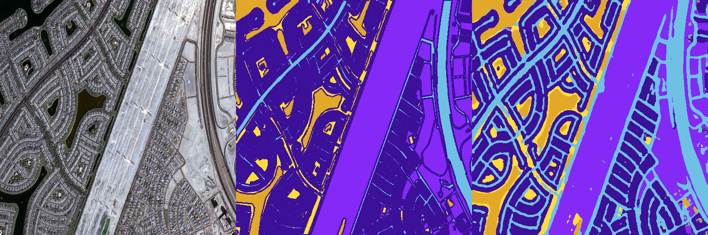

# UNet Semantic Segmentation for Satellite Images

This repository implements semantic segmentation for satellite images using a custom UNet architecture and leveraging Automatic Mixed Precision (AMP) for enhanced training efficiency and better results.

## Project Overview

The goal of this project is to segment satellite images into meaningful classes using deep learning techniques. Here's an overview of what has been implemented:

### Implemented Features

1. **Custom UNet Architecture**: 
   - The `model.py` file defines a UNet architecture tailored for semantic segmentation of satellite images. The architecture consists of encoder and decoder pathways designed to capture both low-level and high-level features.

2. **Automatic Mixed Precision (AMP)**:
   - Utilized PyTorch's AMP feature (`torch.cuda.amp`) in the training process (`train.py`). AMP allows the use of FP16 (half-precision) arithmetic for tensors, reducing memory usage and accelerating training on GPUs that support it.

3. **Training Script**:
   - The `train.py` script orchestrates the training process, including data loading, model instantiation, loss computation, and optimization. It supports AMP, which significantly accelerates training without compromising accuracy.

### Example Result

Below is an example of the segmentation result achieved using the developed UNet model:

*Leftmost image contains input, the middle one shows the expected output, and the rightmost displays the output generated by the model.*
### Results and Benefits

- **Improved Efficiency**: AMP reduces memory usage and speeds up computation, enabling larger batch sizes and faster convergence during training.
  
- **Enhanced Model Performance**: The custom UNet architecture, tailored for satellite image segmentation, enhances the model's ability to capture intricate spatial features in the images.

## Repository Structure

- `README.md`: Project overview and documentation.
- `dataset.py`: Handles dataset loading and preprocessing.
- `extractcolor.py`: Script for extracting color information from images.
- `maskcolors.npy`: Numpy array storing mask colors.
- `model.py`: Custom implementation of the UNet architecture.
- `preprocess.py`: Script for dataset preprocessing.
- `train.py`: Script for training the UNet model.
- `utils.py`: Utility functions used throughout the project.
- `result/`: Directory to store results and output images.

### Future Enhancements

1. **Integration of ResNet Backbone**:
   - Incorporating a ResNet backbone into the UNet architecture (`model.py`) to leverage pre-trained weights and potentially improve segmentation accuracy.

2. **Advanced Image Transformations**:
   - Adding augmentation techniques (e.g., rotation, scaling, flipping) in the training pipeline (`train.py`) to increase model robustness and generalize better to unseen data.

## Contributing

Contributions to enhance this project are welcome! Fork the repository, make your improvements, and submit a pull request.

## License

This project is licensed under the MIT License. See the LICENSE file for more details.

## Acknowledgements

Special thanks to the open-source community and contributors for their valuable insights and resources.

---

For any questions or suggestions, feel free to reach out. Happy coding!
